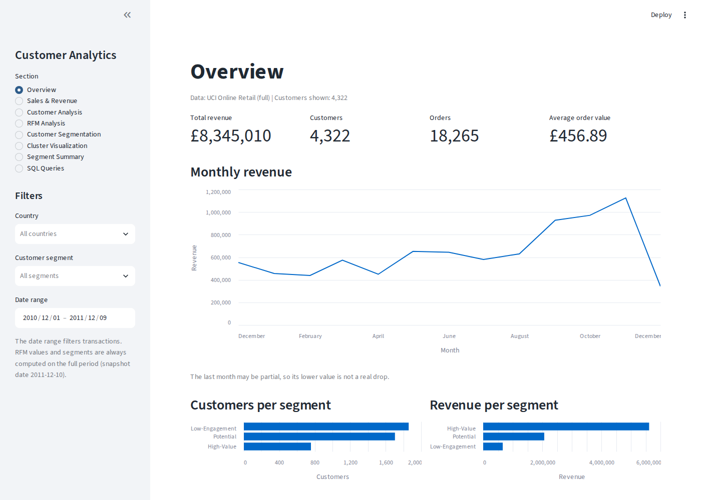
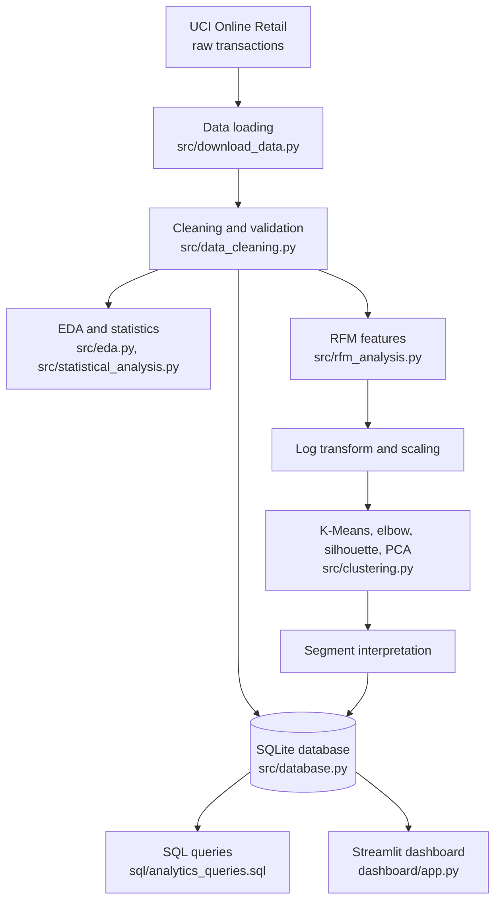
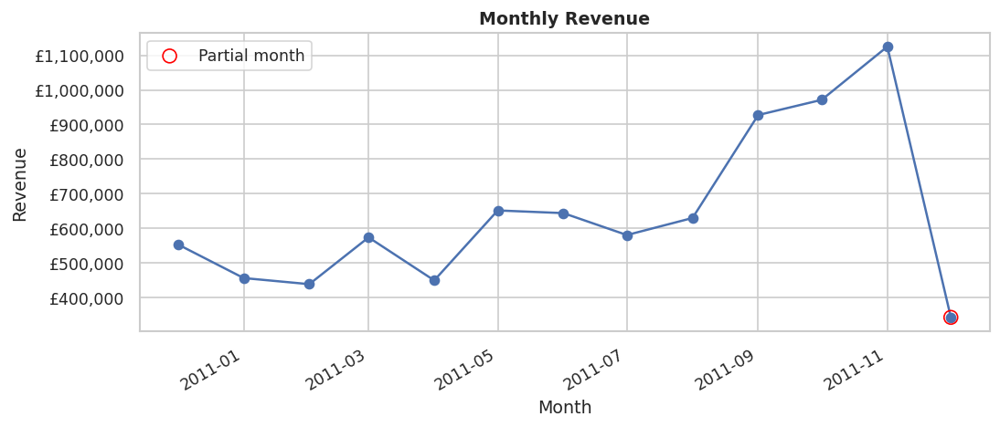
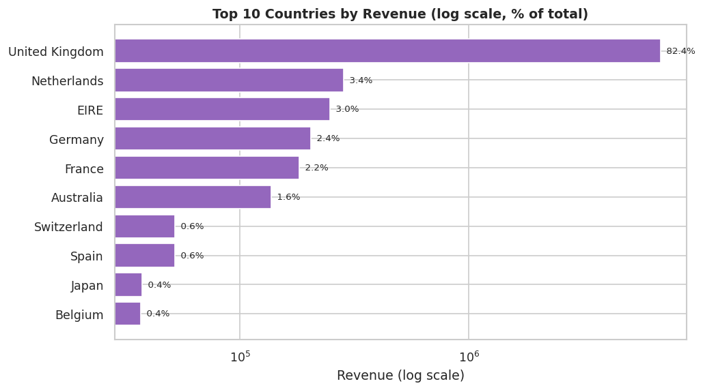
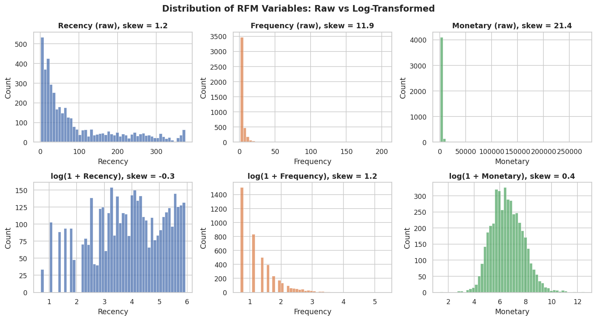
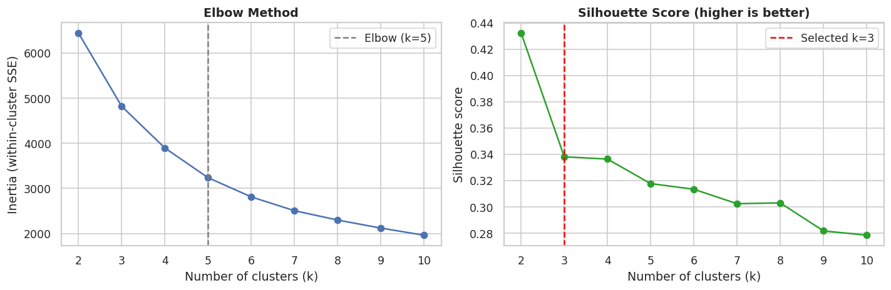
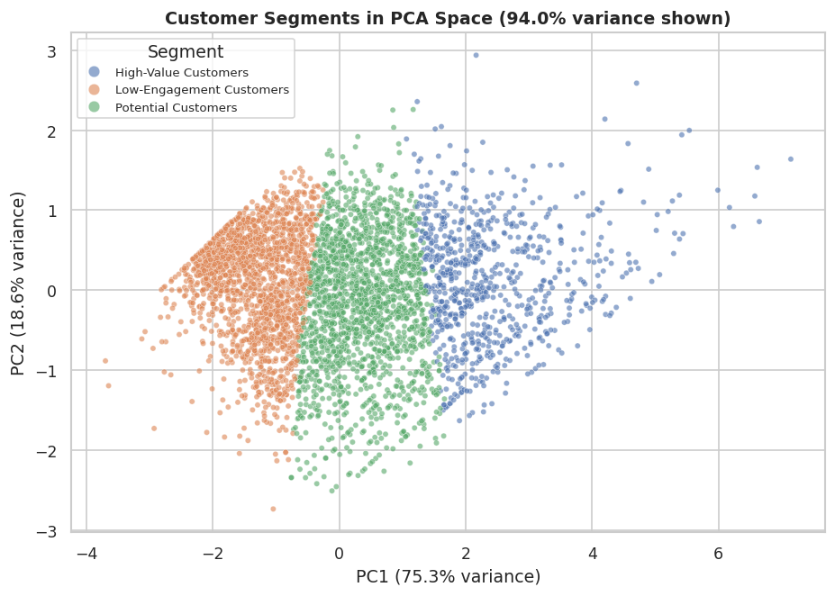
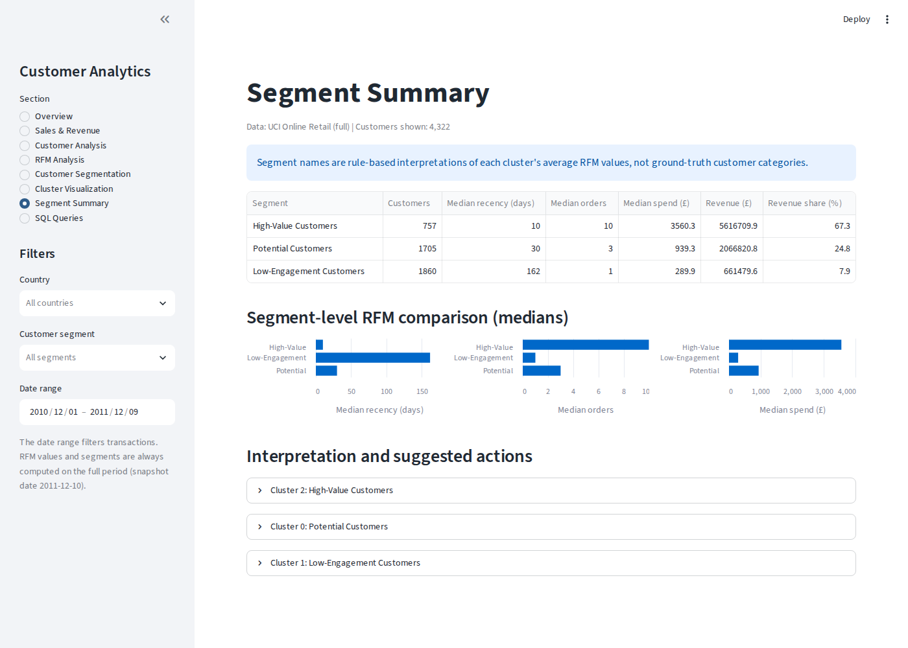
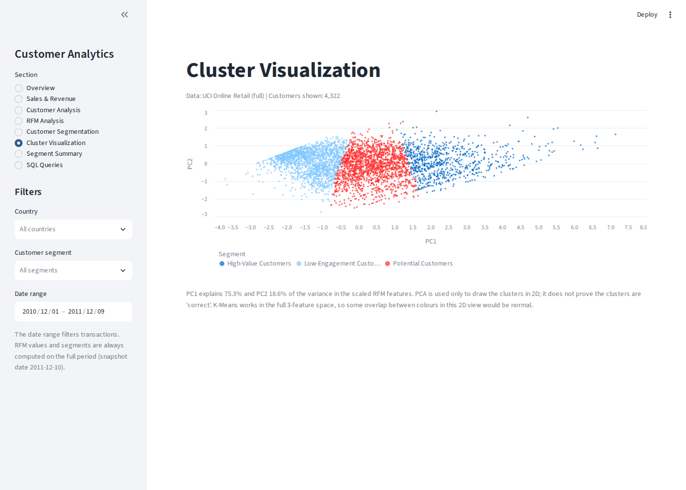
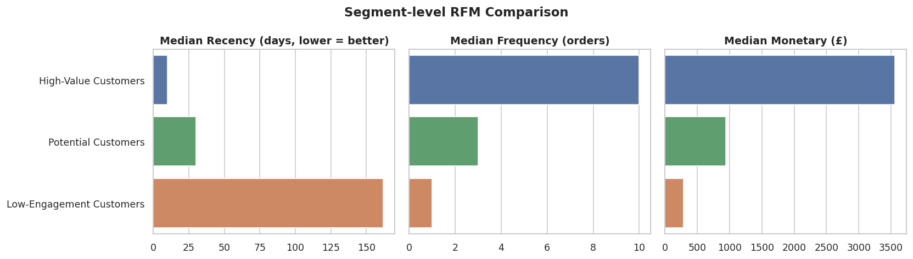

# Customer Segmentation & Behavioral Analytics

Customer segmentation and behavioral analytics using RFM analysis, K-Means clustering, SQL, Python and Streamlit.




## Overview

This project analyses one year of online retail transactions to understand how customers buy, then groups them into segments with similar purchasing behaviour. It covers the full data science workflow: cleaning messy real-world data, exploratory analysis, statistical testing, RFM feature engineering, K-Means clustering with proper evaluation, SQL analytics and an interactive dashboard.

The project is generic. The same pipeline works on any transactional dataset with invoice, product, quantity, date, price, customer and country columns.

## Problem Statement

A business with thousands of customers cannot build a strategy for each one, and treating everyone the same wastes effort. The questions are:

1. How is revenue distributed across time, products, countries and customers?
2. Which natural groups of customers exist, based on how recently, how often and how much they buy?
3. How can each group be described and acted on?

## Objectives

- Clean raw transaction data with documented, reproducible decisions
- Explore sales and customer behaviour with clear visualisations and descriptive statistics
- Build Recency, Frequency and Monetary (RFM) features for every customer
- Choose the number of clusters with the elbow method and silhouette score, not by assumption
- Segment customers with K-Means and interpret the segments from their actual statistics
- Store results in SQLite and answer business questions with SQL
- Present everything in an interactive Streamlit dashboard

## Dataset

**UCI Online Retail**: Chen, D. (2015). *Online Retail* [Dataset]. UCI Machine Learning Repository. https://doi.org/10.24432/C5BW33 (license CC BY 4.0).

- 541,909 invoice lines from a UK-based online retailer, 01/12/2010 to 09/12/2011
- Columns: InvoiceNo, StockCode, Description, Quantity, InvoiceDate, UnitPrice, CustomerID, Country
- Amounts are in pounds sterling (£)

The full dataset is **not** stored in this repository. It is downloaded automatically from UCI by the pipeline (or with `python -m src.download_data`). A small sample (200 customers, 1.7 MB) is included in `data/sample/` for quick testing. See [`data/README.md`](data/README.md) for details and manual download steps.

## Technologies Used

| Area | Tools |
|---|---|
| Language | Python 3.11+ |
| Data processing | Pandas, NumPy |
| Machine learning | scikit-learn (K-Means, PCA, StandardScaler, metrics) |
| Statistics | SciPy |
| Visualisation | Matplotlib, Seaborn |
| Database | SQLite, SQL |
| Dashboard | Streamlit |
| Other | Joblib (model persistence), Jupyter, pytest |

## Project Architecture



`run_pipeline.py` runs every step in order and writes the database, models, figures and CSV reports.

## Methodology

```
Raw transaction data -> Loading -> Cleaning -> Validation -> EDA -> Feature engineering
-> RFM analysis -> Scaling -> K-Means -> Cluster evaluation -> Segment interpretation
-> Dashboard -> Business insights
```

The Jupyter notebook [`notebooks/customer_segmentation_analysis.ipynb`](notebooks/customer_segmentation_analysis.ipynb) walks through every step with explanations.

## Data Cleaning

Every step is logged with the number of rows removed and why (`reports/cleaning_log.csv`):

| Step | Rows removed | Rows left | Reason |
|---|---:|---:|---|
| Raw data | | 541,909 | |
| Exact duplicates | 5,268 | 536,641 | The same line recorded twice would double-count revenue |
| Missing CustomerID | 135,037 | 401,604 | RFM needs to know which customer made the purchase |
| Cancellations | 11,923 | 389,681 | 8,872 cancellation lines, plus the 3,051 purchases they fully cancelled |
| Non-positive UnitPrice | 40 | 389,641 | Free items and adjustments are not real sales |
| Non-product codes | 1,476 | 388,165 | Postage, bank charges, discounts and manual entries |

**Why match cancellations to purchases?** The dataset contains, for example, a single order of 80,995 units that was cancelled minutes later. Simply dropping cancellation lines would leave the original order in the data and make that customer look like the biggest spender. Each cancellation is matched one-to-one to a purchase with the same customer, product, quantity and price, and both are removed.

After cleaning: **388,165 lines, 4,322 customers, 18,265 orders, 3,644 products, 37 countries, £8,345,010 revenue.** All 7 validation checks pass (no missing keys, positive quantities, prices and totals, no cancellations, no duplicates, correct date type).

## Exploratory Data Analysis

| Monthly revenue | Top countries |
|---|---|
|  |  |

- Revenue peaked in **November 2011 (£1,125,180)**. September to November 2011 alone account for 36.2% of the year's revenue, which points to strong seasonality. December 2011 is a partial month (data ends on 9 December).
- The **United Kingdom provides 82.4%** of revenue.
- The median order is £300.54, but the mean is £456.89: a smaller number of very large orders pulls the average up.
- **34.8% of customers ordered only once**, and the **top 10% of customers generate 60.1% of revenue**.

All figures are in [`reports/figures/`](reports/figures/).

## RFM Analysis

For each customer, with a snapshot date of 2011-12-10 (one day after the last transaction):

- **Recency**: days since the last purchase (lower is better)
- **Frequency**: number of distinct orders
- **Monetary**: total spend

| | Mean | Median | Std | Skewness |
|---|---:|---:|---:|---:|
| Recency (days) | 93.3 | 51 | 100.3 | 1.24 |
| Frequency (orders) | 4.2 | 2 | 7.6 | 11.86 |
| Monetary (£) | 1,930.82 | 656.62 | 8,330.85 | 21.38 |

**Why transform and scale?** K-Means uses Euclidean distance. Monetary values run into the hundreds of thousands while Frequency is mostly below 10, so without scaling Monetary would decide the clusters on its own. The distributions are also extremely right-skewed, so a few very large customers would pull the centroids. Applying `log(1 + x)` reduces skewness (Frequency 11.86 → 1.22, Monetary 21.38 → 0.37), and `StandardScaler` then puts all three features on the same scale.



Classic 1–5 quintile RFM scores are also computed as a simple rule-based baseline.

**Statistical analysis** (`src/statistical_analysis.py`): descriptive statistics, IQR outlier counts, Spearman correlation (Frequency and Monetary ρ = 0.81; Recency with Frequency ρ = −0.57) and one hypothesis test:

> **Mann-Whitney U test:** do UK and international customers differ in average order value?
> UK median £276.70 (n = 3,907) vs international £387.31 (n = 415); p = 3.1 × 10⁻²², rank-biserial effect size −0.29.
> The difference is statistically significant, and international customers tend to place larger orders. A non-parametric test was used because order values are heavily skewed.

## Customer Segmentation

Customers are grouped using only their scaled Recency, Frequency and Monetary values. The number of clusters is chosen from the data (next section), and each cluster is then **named automatically from its own statistics**. The rules compare each cluster's average standardised score with the overall average:

| Condition (0 = average customer) | Segment name |
|---|---|
| Recent, frequency and spend both clearly high (> 0.5 SD) | High-Value Customers |
| Recent, frequency or spend above average (> 0.25 SD) | Loyal / Frequent Customers |
| Recent, frequency and spend about average or lower | Potential Customers |
| Not recent, frequency or spend above average | At-Risk Customers |
| Not recent, low frequency and spend | Low-Engagement Customers |

These names are **analytical interpretations, not ground-truth categories**. No label is hard-coded to a cluster number.

## K-Means Clustering

K-Means was run for k = 2 to 10:

| k | Inertia | Silhouette | Davies-Bouldin |
|---:|---:|---:|---:|
| 2 | 6,447.9 | 0.433 | 0.890 |
| **3** | **4,821.8** | **0.338** | **1.040** |
| 4 | 3,896.6 | 0.336 | 1.015 |
| 5 | 3,236.9 | 0.318 | 0.983 |
| 6 | 2,811.5 | 0.313 | 1.017 |
| 7 | 2,505.0 | 0.302 | 0.988 |
| 8 | 2,297.8 | 0.303 | 0.989 |
| 9 | 2,119.2 | 0.282 | 1.021 |
| 10 | 1,961.2 | 0.278 | 1.023 |



**Selection rule (fixed in advance):** choose the highest silhouette score among k ≥ 3. k = 2 scores highest overall, but it only separates active from inactive customers, which is too coarse for segmentation. This gives **k = 3**. The elbow method suggests k = 5. The two methods disagree, which is common for customer data that forms a continuum rather than separate blobs. A silhouette of about 0.34 means **moderate** cluster structure.

- **Stability:** the mean Adjusted Rand Index between runs with 5 different random seeds is **0.978**, so the result is reproducible.
- **Cross-check:** the independent RFM quintile score (3–15) averages 14.2 for High-Value, 10.4 for Potential and 5.6 for Low-Engagement customers.
- **Sensitivity:** k = 4 (silhouette 0.336) keeps the high-value group almost unchanged and splits out an At-Risk group. The notebook shows it, and it can be run with `python run_pipeline.py --k 4`.

## PCA

PCA reduces the three scaled features to two components for plotting. PC1 explains 75.3% of the variance and PC2 18.6% (94.0% together). PC1 loads on all three features (Recency −0.51, Frequency 0.62, Monetary 0.60), so it works as an overall engagement axis.



PCA is used **only for visualisation**. The clustering happens in the full feature space, and a clean 2-D picture is not proof that the clusters are "correct".

## SQL Analysis

The cleaned transactions and customer segments are stored in SQLite (`data/processed/retail_analytics.db`). [`sql/analytics_queries.sql`](sql/analytics_queries.sql) contains nine commented queries: total revenue, revenue by country, top customers, number of orders, average order value, monthly revenue, customer purchase frequency, customer monetary value and a segment summary. They use `GROUP BY`, subqueries, CTEs (`WITH`), `CASE` bands and `strftime` date handling.

```bash
python -m src.database   # prints every query result
```

Example results: the average order value is £456.89 across 18,265 orders. Customers who spent £5,000 or more are only 262 of 4,322 customers, yet they account for 51.8% of revenue. Results are also saved to `reports/sql_results/`.

## Dashboard

`streamlit run dashboard/app.py` opens an interactive dashboard with eight sections: Overview, Sales & Revenue, Customer Analysis, RFM Analysis, Customer Segmentation, Cluster Visualization, Segment Summary and SQL Queries.

- KPI cards: total revenue, customers, orders, average order value
- Filters: country, customer segment and date range
- Charts: revenue trend, customer distribution, RFM distributions, cluster sizes, PCA scatter and segment-level RFM comparison

| Segment summary | Cluster visualisation |
|---|---|
|  |  |

## Results

Final model: K-Means, k = 3, silhouette 0.338, Davies-Bouldin 1.040, stability ARI 0.978.

| Segment | Customers | % customers | % revenue | Median recency | Median orders | Median spend |
|---|---:|---:|---:|---:|---:|---:|
| High-Value Customers | 757 | 17.5% | 67.3% | 10 days | 10 | £3,560 |
| Potential Customers | 1,705 | 39.4% | 24.8% | 30 days | 3 | £939 |
| Low-Engagement Customers | 1,860 | 43.0% | 7.9% | 162 days | 1 | £290 |



## Key Insights

1. **Revenue is concentrated.** 17.5% of customers (High-Value) generate 67.3% of revenue. Retaining them, for example through loyalty benefits and priority service, matters more than any other single action.
2. **The second purchase is the main growth lever.** About a third of customers bought only once. The Potential segment is recent and moderately active, so recommendations and follow-up offers aimed at repeat purchases fit this group.
3. **The largest segment is low value.** Low-Engagement customers are 43% of the base but bring in 7.9% of revenue, so low-cost automated re-engagement suits them better than expensive campaigns.
4. **Timing matters.** Revenue peaks in September–November, so retention and win-back campaigns should run before the peak.
5. **International customers place larger orders** (significant, with a small-to-moderate effect size). This may reflect more wholesale buyers and is worth checking before designing country-specific offers.

These are hypotheses from historical data, to be validated (for example, with A/B tests) before acting on them.

## How to Run

Requirements: Python 3.11 or newer.

```bash
# 1. Get the code
git clone https://github.com/Coderchintu/customer-segmentation-behavioral-analytics.git
cd customer-segmentation-behavioral-analytics

# 2. Create a virtual environment and install dependencies
python -m venv .venv
# Windows:        .venv\Scripts\activate
# macOS / Linux:  source .venv/bin/activate
pip install -r requirements.txt

# 3. Run the pipeline (downloads the dataset from UCI on first run, ~1 minute)
python run_pipeline.py
#    or a quick run on the bundled sample:
python run_pipeline.py --sample

# 4. Open the dashboard
streamlit run dashboard/app.py

# Optional
python -m src.database                                     # SQL query results
jupyter notebook notebooks/customer_segmentation_analysis.ipynb
python -m pytest                                           # unit tests
python run_pipeline.py --k 4                               # try a different k
```

Run all commands from the project root. Sample-mode reports are written to `reports/sample_run/` so they never overwrite the full-dataset results.

## Project Structure

```
customer-segmentation-behavioral-analytics/
├── data/
│   ├── raw/                  # full dataset (downloaded, not in Git)
│   ├── processed/            # SQLite database (generated, not in Git)
│   ├── sample/               # small sample dataset
│   └── README.md             # source, license, download steps
├── notebooks/
│   └── customer_segmentation_analysis.ipynb
├── src/
│   ├── download_data.py      # download dataset from UCI
│   ├── data_cleaning.py      # loading, cleaning, validation
│   ├── eda.py                # exploratory plots
│   ├── statistical_analysis.py
│   ├── rfm_analysis.py       # RFM features and quintile scores
│   ├── clustering.py         # scaling, K-Means, evaluation, PCA, interpretation
│   ├── database.py           # SQLite creation and query runner
│   └── utils.py              # paths, constants, helpers
├── sql/
│   └── analytics_queries.sql
├── dashboard/
│   └── app.py                # Streamlit dashboard
├── models/                   # saved scaler, K-Means and PCA (generated)
├── reports/                  # figures, screenshots, CSV tables, summary.json
├── tests/
│   └── test_pipeline.py
├── run_pipeline.py           # runs the whole pipeline
├── requirements.txt
├── pytest.ini
├── LICENSE
└── README.md
```

## Limitations

- **One retailer, about one year of data:** seasonality and customer lifetime cannot be studied over several years, and results may not generalise.
- **Mostly UK customers:** international comparisons rest on 415 customers.
- **Missing customer IDs:** about 25% of transaction lines had no CustomerID and were excluded, so guest buyers are not represented.
- **RFM only:** segments ignore *what* customers buy (product categories, basket content).
- **K-Means assumptions:** it favours roughly spherical, similar-sized clusters. With a silhouette of about 0.34, the segments are useful groupings rather than sharply separated natural classes.
- **Simple cancellation matching:** partial returns are not linked to their original purchase.
- **Segment names come from rules:** they are interpretations, and the business actions are suggestions, not tested results.

## Future Scope

- Add product-category and basket features to the segmentation
- Compare with other clustering methods (Gaussian Mixture Models, hierarchical clustering, DBSCAN)
- Track how customers move between segments over time
- Predict customer lifetime value or churn using the segments as features
- Test the suggested segment actions with A/B experiments

## Contributors

- Raj Kumar Mahato — [@Coderchintu](https://github.com/Coderchintu)
- Anshu Kumari — [@Anshugit0203](https://github.com/Anshugit0203)

## License

The code is released under the [MIT License](LICENSE). The dataset belongs to its authors and is used under CC BY 4.0 (see [`data/README.md`](data/README.md)).
